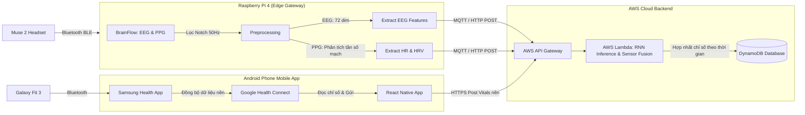
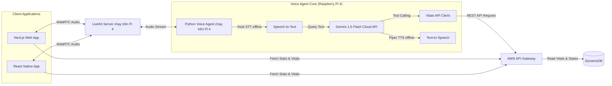

# Kế hoạch Thiết kế & Triển khai Hệ thống Trợ lý Âm thanh Y tế (Tối ưu chạy chính trên Raspberry Pi 4)

Bản kế hoạch này trình bày cấu trúc thiết kế tối ưu, lộ trình triển khai và các tính năng cao cấp cho hệ thống y tế chạy chính trực tiếp trên **Raspberry Pi 4**:
*   **Thiết bị chạy chính (Core Host):** Raspberry Pi 4 (4GB RAM) chạy toàn bộ LiveKit Server, Python Voice Agent, và chương trình thu thập dữ liệu y tế Muse 2.
*   **Máy trạm kết nối (Bridge PC):** Fedora 44 (i5-1135G7, 16GB RAM) chỉ đóng vai trò kết nối terminal SSH, biên dịch code, và phát triển/thử nghiệm.
*   **LLM Engine:** **Google Gemini 1.5 Flash API** (Cloud API kết nối từ Raspberry Pi 4).
*   **STT Engine:** **Vosk STT** (Chạy offline cực nhẹ, tiêu tốn ít RAM/CPU trên Raspberry Pi 4).
*   **TTS Engine:** **Piper TTS** (Chạy offline qua ONNX, được tối ưu hóa đặc biệt để sinh giọng nói thời gian thực trên chip ARM của Raspberry Pi 4).
*   **Thiết bị đo EEG & PPG Real-time:** Muse 2 (Bluetooth BLE kết nối trực tiếp với Raspberry Pi 4, cảm biến PPG đo mạch ở vùng chẩm/trán chẩm).
*   **Thiết bị đo Vitals nền 24/7:** Galaxy Fit 3 (Đồng bộ gián tiếp qua Google Health Connect trên điện thoại Android).

---

## Luồng Hoạt động Hệ thống (System Pipeline Architecture)

### 1. Luồng xử lý và Hợp nhất dữ liệu sinh học (EEG & PPG Sensor Fusion)
Sơ đồ mô tả luồng dữ liệu từ Muse 2 (real-time qua Bluetooth) và Galaxy Fit 3 (đồng bộ gián tiếp qua Android Health Connect) hội tụ trên AWS Cloud:



### 2. Luồng Trợ lý Giọng nói & Ứng dụng Client (Voice Agent & Clients Pipeline)
Sơ đồ mô tả luồng đàm thoại giọng nói WebRTC và tích hợp với **Google Gemini 1.5 Flash Cloud API** chạy trực tiếp trên **Raspberry Pi 4**:



---

## Chi tiết Kỹ thuật Hợp nhất Cảm biến (Sensor Fusion Details)

### 1. Đồng bộ nhịp tim theo thời gian thực (Real-time Heart Rate)
*   **Khi sử dụng Muse 2:** Tính toán **Nhịp tim tức thời** và **Biến thiên nhịp tim (HRV)** thời gian thực từ cảm biến PPG vùng chẩm/trán chẩm qua Raspberry Pi 4. Dữ liệu này được xử lý cục bộ trên Pi 4 trước khi gửi lên AWS.
*   **Khi sinh hoạt bình thường:** Nhịp tim nền lấy từ Galaxy Fit 3 (đồng bộ qua Health Connect ➜ AWS) để vẽ biểu đồ xu hướng cả ngày.
*   **Thuật toán Hợp nhất (Fusion Logic):** AWS Lambda ưu tiên ghi đè giá trị nhịp tim của Muse 2 trong phiên đo active, và sử dụng dữ liệu Galaxy Fit 3 trong các khoảng thời gian sinh hoạt thông thường.

### 2. Hợp nhất phân tích giấc ngủ (Sleep Tracking Fusion)
*   Kết hợp phân tích chu kỳ sóng não EEG từ Muse 2 (ở giai đoạn đầu giấc ngủ) với dữ liệu chuyển động và nhịp tim nền của Galaxy Fit 3 (suốt cả đêm) để tối ưu hóa biểu đồ giấc ngủ chính xác nhất.

---

## 🚀 Các Tính năng Tối ưu hóa & Cao cấp (Premium Features)

### 1. Trợ lý Chủ động Cảnh báo (Proactive Voice Alerting)
*   **Chức năng:** Trợ lý ảo chạy trên Raspberry Pi 4 có khả năng **chủ động bắt đầu cuộc gọi thoại** cảnh báo người dùng.
*   **Kịch bản:** Khi AWS Lambda phát hiện chỉ số y tế bất thường vượt ngưỡng nguy hiểm, hệ thống gửi request kích hoạt cuộc gọi tới LiveKit Server chạy trên Pi 4 để gọi cho người dùng.

### 2. Phân tích Stress nâng cao (EEG + HRV Cognitive-Stress Index)
*   **Chức năng:** Kết hợp đồng thời dữ liệu sóng não EEG và chỉ số HRV được tính toán trực tiếp trên Raspberry Pi 4 để đưa ra đánh giá mức độ căng thẳng của não bộ.

### 3. Nhật ký Sức khỏe bằng Giọng nói (Voice Health Logging)
*   **Chức năng:** Người dùng có thể ra lệnh ghi nhật ký hoạt động bằng giọng nói. Gemini LLM trên cloud sẽ phân tích câu nói, bóc tách thông tin có cấu trúc và gọi Function Tool để lưu trữ vào AWS.

### 4. Bài tập thở tương tác sinh học (Interactive Biofeedback Breathing)
*   **Chức năng:** Trợ lý ảo hướng dẫn bài tập thở và **tự động điều chỉnh tốc độ đếm nhịp** dựa trên nhịp tim đo được thời gian thực từ Muse 2 truyền trực tiếp qua Bluetooth của Raspberry Pi 4.

### 5. Phân tách Ngữ cảnh Luyện tập (Workout Mode Isolation)
*   **Phát hiện (Detection):** Điện thoại đọc trạng thái phiên luyện tập active từ **Galaxy Fit 3** qua Google Health Connect.
*   **Cách ly EEG:** Toàn bộ tín hiệu EEG ghi nhận được trong thời gian này sẽ được dán nhãn là `Activity: Workout` để loại bỏ khỏi dữ liệu phân tích tập trung/thư giãn dài hạn nhằm tránh nhiễu do vận động cơ.
*   **Bộ lọc cảnh báo nhịp tim:** Chuyển sang **Chế độ theo dõi giới hạn tim mạch (Workout HR Zone)**: Chỉ phát cảnh báo nếu nhịp tim vượt ngưỡng tối đa an toàn tính theo tuổi ($220 - \text{Tuổi}$).

### 6. Thiết lập Tiêu chuẩn Sóng não Cá nhân hóa từ Metadata (Metadata-Driven Adaptive EEG Baseline)
*   **Phân tích Chỉ số Sức khỏe từ Metadata:** Tính toán BMI (hiệu chỉnh độ nhạy thở ngủ sâu), BMR và ngưỡng sinh lý an toàn từ Tuổi, Giới tính, Chiều cao, Cân nặng.
*   **Cân chỉnh Tiêu chuẩn Sóng não EEG thích ứng:** Raspberry Pi 4 hiệu chỉnh dải lọc tần số Alpha (Alpha dominant rhythm) tương ứng theo tuổi người dùng và cân chỉnh Baseline cá nhân hóa sau 3 phiên đo đầu tiên.

---

## Cấu trúc Thư mục Đề xuất (Proposed Folder Structure)

```text
d:\Project\
├── 01_Documents\                     <-- Sách tham khảo EEG, tài liệu nghiên cứu, ghi chú ý tưởng
│   ├── 02_cambridge-core...\         <-- Sách hướng dẫn đọc sóng não EEG
│   ├── 03_Kotai-VoiceAgent\          <-- Mã nguồn mẫu trợ lý giọng nói chạy local tham khảo
│   │   └── Kotai-VoiceAgent\
│   │       ├── backend\
│   │       │   └── Kokoro-TTS-Local\
│   │       └── frontend\
│   └── yy_Brainstorms\               <-- Các ghi chép ý tưởng ban đầu của nhóm phát triển
├── 03_Outputs\                       <-- Báo cáo kết quả dự án, thiết kế luồng xử lý (pipeline)
├── 04_Code\                          <-- Toàn bộ mã nguồn triển khai của hệ thống
│   ├── audio-agent\                  <-- Core Voice Agent & Edge Client chạy trên Raspberry Pi 4
│   │   └── tools\                    <-- Chứa các API Tools định nghĩa cho Gemini LLM
│   ├── aws-services\                 <-- Xử lý tiền lọc tín hiệu y tế và mô hình GRU RNN trên AWS
│   ├── mobile-app\                   <-- Ứng dụng di động Android (React Native / Expo)
│   └── web-app\                      <-- Ứng dụng Web Dashboard quản lý (Next.js)
│       └── app\                      <-- Thư mục chứa các page của Next.js App Router
├── 05_Data\                          <-- Nơi lưu trữ tập dữ liệu (Dataset) phục vụ nghiên cứu & AI
│   ├── metadata\                     <-- Cấu hình sơ đồ kênh đo, thông tin đối tượng tham gia
│   ├── processed\                    <-- Dữ liệu EEG/PPG đã qua lọc nhiễu và chia cửa sổ
│   └── raw\                          <-- Tín hiệu sóng y tế thô thu từ Muse 2
├── 06_Models\                        <-- Lưu trữ các trọng số và checkpoints của mô hình GRU RNN
└── 07_Experiments\                   <-- Nhật ký chạy thử nghiệm và đánh giá chất lượng mô hình
```

---

## Lộ trình Phát triển theo Cột mốc (Milestones Plan)

### 📍 Milestone 1: Thu nhận & Xử lý biên EEG + PPG (Muse 2 + Raspberry Pi 4)
*   **Mục tiêu:** Kết nối thành công Muse 2 qua BLE trên Pi 4, thu nhận đồng thời dữ liệu sóng não EEG và mạch đập PPG, tính toán đặc trưng biên và HRV.
*   **Sản phẩm bàn giao:** Log dữ liệu EEG (72 đặc trưng) và chỉ số nhịp tim/HRV tức thời từ PPG xuất ra màn hình Raspberry Pi 4 mỗi giây.

### 📍 Milestone 2: Tích hợp Đám mây & Hợp nhất cảm biến (AWS Backend)
*   **Mục tiêu:** Xây dựng API nhận dữ liệu từ các nguồn khác nhau, thực hiện thuật toán hợp nhất chỉ số (Sensor Fusion) và lưu trữ vào DynamoDB.
*   **Sản phẩm bàn giao:** Hệ thống lưu trữ AWS hoàn thiện, tự động tối ưu hóa dữ liệu nhịp tim/giấc ngủ.

### 📍 Milestone 3: Đàm thoại Giọng nói & Tích hợp Gemini 1.5 Flash trên Pi 4
*   **Mục tiêu:** Khởi chạy LiveKit Server và Voice Agent chạy trực tiếp trên **Raspberry Pi 4**, sử dụng Vosk STT local, Gemini API và Piper TTS local.
*   **Sản phẩm bàn giao:** Trợ lý ảo phản hồi trôi chảy tiếng Việt từ loa của Raspberry Pi 4 (hoặc qua ứng dụng khách Web/Android kết nối đến Pi 4).

### 📍 Milestone 4: Giao diện Web, Android App & Kết nối Samsung Health (Clients)
*   **Mục tiêu:** Hoàn thiện Web App Next.js vẽ biểu đồ tương quan sức khỏe; Xây dựng Android App tích hợp đọc dữ liệu Samsung Health qua Health Connect.
*   **Sản phẩm bàn giao:** Ứng dụng Web hiển thị biểu đồ phân tích tương quan; Ứng dụng di động Android tự động đồng bộ dữ liệu Galaxy Fit 3 lên cloud và thực hiện cuộc gọi LiveKit kết nối trực tiếp đến LiveKit Server của Raspberry Pi 4.

---

## Verification Plan

### Automated Tests
1. **Gemini API Connectivity Test:** Chạy test script gửi prompt từ Raspberry Pi 4 kiểm tra phản hồi từ mô hình `gemini-1.5-flash` và tính đúng đắn của schema Function Calling.
2. **PPG Signal Filter Test:** Chạy dữ liệu PPG giả lập qua bộ lọc trên Pi 4 để kiểm tra độ chính xác của thuật toán tính toán nhịp tim/HRV.
3. **Health Connect Sync Test:** Viết mock data trên Android để test luồng đọc dữ liệu từ Health Connect và đẩy lên AWS API.

### Manual Verification
1. Đeo Muse 2 kết nối Pi 4, đồng thời đeo Galaxy Fit 3 đồng bộ với điện thoại Android.
2. Khởi chạy cuộc gọi thoại LiveKit trên điện thoại/web kết nối đến máy chủ LiveKit Server trên Raspberry Pi 4. Hỏi: *"Nhịp tim của tôi hiện tại thế nào?"*
3. Xác nhận: Trợ lý (chạy Gemini 1.5 Flash thông qua Voice Agent của Raspberry Pi 4) trả lời chính xác nhịp tim tức thời đo từ Muse 2 (vùng chẩm/trán chẩm).
4. Tháo Muse 2 ra, hoạt động bình thường, sau đó hỏi lại trợ lý. Xác nhận trợ lý trả lời nhịp tim nền đồng bộ gần nhất từ Galaxy Fit 3.
5. Giả lập chỉ số nhịp tim tăng vọt trên AWS. Xác nhận Trợ lý tự động kích hoạt phiên gọi thoại cảnh báo chủ động đến người dùng.
